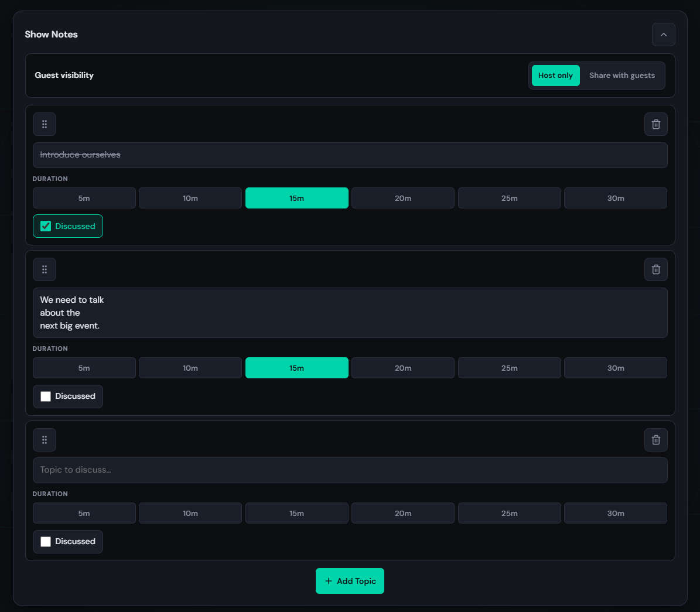
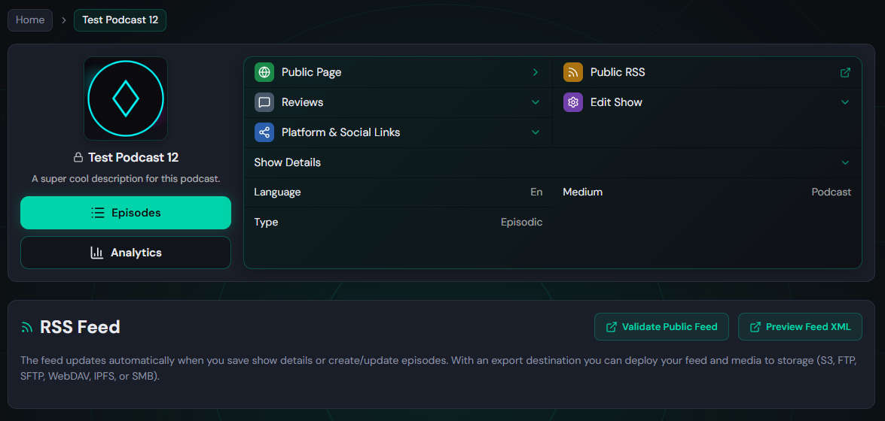
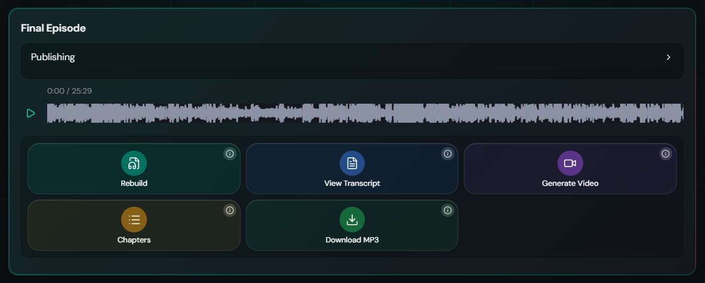

# Changelog

## v1.7.5 - 2026-07-12

- **Podcast analytics:** Listener vs crawler classification for RSS and enclosure stats (known podcast apps count as listeners; directory agents like `Spotify/1.0`, Amazon Music Podcast, and feed bots count as crawlers).
- **Podcast analytics:** Tiny partial Range probes (for example feed `preload` metadata) no longer count as episode requests; full-file GETs still do. Public feed and embed players use `preload="none"`.
- **Podcast analytics UI:** Overview charts use listener totals by default; People/Apps relabeled Listeners/Crawlers.
- **Dev tooling:** Added `dev/logs-analytics/analyze_access_log.py` to reconcile nginx access logs with in-app analytics exports.

## v1.7.4 - 2026-07-11

- **Custom domain Open Graph:** Fixed index root with linking domain error

## v1.7.3 - 2026-07-11

- **Custom domain Open Graph:** Fixed linking-domain homepages serving default HarborFM meta instead of podcast-specific tags.

## v1.7.2 - 2026-07-11

- **Public feed Open Graph:** Podcast and episode feed pages now serve podcast-specific meta tags in the initial HTML (title, description, `og:url`, `og:site_name`, and cover image) so link previews and view-source work for crawlers, not just after React loads.
- **Custom domains:** Feed pages on a linking domain use the podcast cover as the favicon when available.

## v1.7.1 - 2026-07-11

- **Episode editor:** Added a collapsible Show Notes panel for planning call topics: add topics with optional duration (5–30 min), mark items as discussed, drag to reorder, and choose whether guests can see notes (host only or share with guests). Collapsed by default; expand with the chevron in the header.
- **Group call guests:** When the host enables guest visibility, participants on the call can open **See Show Notes** to view planned topics and durations in a dialog; notes update live over the call WebSocket.
- **Section editor:** Ask tab responses now render in a read-only text field instead of plain text, so clicking in and using Ctrl+A / copy selects only the answer, not the whole page.

## v1.7.0 - 2026-07-10

- **Group call recording:** When a guest backgrounds the tab or unmutes after mute, the client now creates a new WebRTC producer instead of resuming the old one so multitrack segments stay time-aligned.
- **Group call participants:** Fixed host participant list Strict Mode remount cleanup.
- **Group call guests:** Recording banner with elapsed time above "You're In The Call" on the guest join page.
- **Group call:** Increased host remount grace period (500ms to 2s) so page refreshes are less likely to end the call.

## v1.6.6 - 2026-07-09

- **Episode editor:** Redesigned the Final Episode box with a collapsible publishing panel, action tile grid for build/export tools, and improved mobile layout.
- **Podcast page:** Redesigned the show header with prominent Episodes/Analytics actions, a grouped action list for public links and show settings, and a tighter responsive layout.
- **Platform & Social Links:** Added Discord link under Follow (fixes #49).
- **Platform & Social Links:** Fixed saved URLs not persisting after refresh.

## v1.6.5 - 2026-07-06

- **White Label:** New setting in Access & General replaces "HarborFM" on public feed headers, episode pages, and embed players when configured.
- **Embed player layout:** Responsive controls for narrow and short iframes: hide total duration below 250px width; compact volume slide-over below 200px; hide waveform, time, and speed below 150px width (play button centered); hide all playback controls below 150px height; stack season/episode above the brand link at 150px width. Fixed overflow scrollbars in small embeds and vertically centered content.
- **Dev:** Local `dev/iframe-test.html` tool to preview embed URLs at sizes from 100px to 500px (width, height, and square sweeps), with per-size notes, reset, and viewport-based iframe loading.

## v1.6.4 - 2026-07-06

- **Global playback settings:** Volume and playback speed (1x, 1.5x, 2x, 2.5x) persist in `localStorage` and apply across feed, episode, and embed players.
- **Listen position:** Feed and episode pages remember where you left off per episode. Position is shared between the feed list and the episode page.
- **Feed player fixes:** Playback speed from `localStorage` is applied correctly after refresh when the waveform player mounts. Starting a different episode on the feed list now stops the previous episode's audio instead of leaving it playing in the background.
- **CI:** GitHub Actions workflows updated to Node 24-compatible action versions (Docker and Pages jobs).

## v1.6.3 - 2026-07-06

- **Public feed player:** Playback controls below the waveform on the podcast feed and episode pages: current time / duration, speed (1x, 1.5x, 2x, 2.5x), and volume, matching the embed player. On the feed list, controls appear only while an episode is playing and animate in/out with a fade slide; on the episode page they are always visible when audio is available.
- **RSS feed preview on custom domains:** RSS `xml-stylesheet` now uses a root-relative `/style.xsl` URL so browser feed previews work on linked/managed domains (fixes cross-origin blocking when the feed was served from a custom domain but pointed at the app host). Cached feeds with an absolute stylesheet URL are regenerated on the next request.

## v1.6.2 - 2026-05-07

- **Dashboard:** RSS podcast import shows a **dismissible progress panel** (bottom corner on desktop, along the bottom on small screens) with a **progress bar** and status text instead of a blocking full-screen modal while importing. The feed URL dialog closes after the import starts; you can hide progress until you refresh the page. The Import action stays disabled while an import is in progress.
- **Podcast analytics:** Episode Requests and Listens **bar** charts now include at most the **8 most recent episodes** (same order as elsewhere: newest publish/update first), with taller charts and a wider Y-axis so episode titles stay readable. The **table** view still lists every episode with full titles; when a show has more than eight episodes, a short note under the bar chart explains the limit.
- Fixed 2 minor bugs

## v1.6.1 - 2026-03-14

- **Episode editor:** Adjusted details summary layout (flex row, gap) and badge styling (removed margin).
- **Record modal:** Fixed React Hook useEffect dependency warnings (exhaustive-deps).
- **Microphone:** Fixed bug where browser did not prompt for microphone permissions on record modal open.
- **EQ:** Fixed EQ not being saved correctly.

## v1.6 - 2026-02-28

- **Instance manager:** Web UI to list and deploy HarborFM instances via Terraform (AWS or Vultr).

## v1.5.1 - 2026-02-22

- **Podcast analytics breakdown:** Stats (RSS, episode requests, episode listens, location) now include a **source** dimension (Apple Podcasts, Spotify, Google Podcasts, Pocket Casts, Overcast, or Other) derived from User-Agent; analytics API and UI show counts per source so you can see which apps drive traffic.
- **Docker Compose:** Staging environment now uses the main Docker image in docker-compose (fixed staging config).
- **Group calls:** Fixed auto gain control (AGC) resetting incorrectly when refreshing the page.
- **Reviews Missing:** Fixed reviews not showing up even when enabled.

## v1.5 - 2026-02-20

- **Reviews:** Podcast and episode reviews with public submit (name, email, rating, body); optional CAPTCHA and subscriber-only per podcast; verification email with verify and delete links; public list with verified/approved filtering and delete-own or admin delete; admin list, approve, and hide (manager/owner); optional LLM spam check;
- **Admin settings (tabbed):** Settings page redesigned with a tabbed layout; each section (Access & General, Default Limits, Final Output, etc.) is a tab; first tab is System (version, command status, memory/CPU/disk from new system-stats API); global search filters tabs and scrolls to matching controls (e.g. “Account Registration” to Enable Account Registration); single form and one Save across all tabs; vertical sidebar on desktop, drawer on mobile; keyboard navigation (arrows, Home/End) and Escape to close drawer;
- **Custom domain feed:** HarborFM header (name and logo) is hidden on podcast and episode feed pages when viewed on a custom domain (link/managed domain).
- **Segment audio EQ:** Per-segment equalizer in the segment editor: Audio button (right of Zoom Out) with Low / Mids / High sliders (-20 to +20 dB); live Web Audio preview; Apply stores EQ locally until Save, Cancel reverts; same EQ applied when rendering the final episode (ffmpeg bass, equalizer, treble); segment list playback uses saved EQ when present.
- **Segment enable/disable:** Owners, admins, and editors/managers can exclude segments from the final episode via an Eye button to the right of the segment editor (Scissors) button on the episode details page; disabled segments show a black row and EyeOff icon; toggling again re-enables; disabled segments are omitted when building the final episode; "Generate Episode Audio" is disabled when all segments are disabled.
- **Disable account:** Profile page has a "Disable Account" card at the bottom; users can disable their own account (password confirmation for password accounts, "Are you sure?" popup for federated); 2FA must be disabled first; read-only and sole-admin accounts cannot disable; logout succeeds after disable so the user is signed out.
- **Subscriber Only Messages:** In Edit Podcast Details, when Subscribers Enabled is on, a new toggle "Subscriber Only Messages" (off by default) restricts the Message button on the public podcast and episode pages to visitors signed in as subscribers; contact API returns 403 for that podcast when the request is not from an authenticated subscriber; e2e scenario tests cover setting persistence and contact enforcement.
- **Show Scheduled Episodes:** In Edit Podcast Details, a new toggle "Show Scheduled Episodes" (off by default) below Allow Unapproved Reviews; when on, episodes that are scheduled or published with a future publish date appear on the public feed and episode pages with a "Premiering [date]" placeholder instead of the player; markers, waveforms, and audio are not loaded or served for anyone until the release date.

## v1.4 - 2026-02-18

- **Federation (SAML & OIDC):** Single sign-on with configurable OIDC and SAML providers; admin-configurable providers in settings (`ssoOidcProviders`, `ssoSamlProviders`) with encrypted client/cert secrets; OIDC discovery and authorization-code flow with PKCE; SAML IdP flow with state and optional in-response-to validation; user identities linked to local accounts; resolve-or-create and login-by-identity flows; SAML request-id cache and OAuth state/nonce tables for security.
- **Database: Drizzle ORM:** Migrated from raw better-sqlite3 usage to Drizzle ORM; SQLite remains the default store (via `drizzle-orm/better-sqlite3`); typed schema and queries across auth, episodes, podcasts, segments, tokens, and other modules; Drizzle Kit for migrations, studio, and optional MySQL push (`db:generate`, `db:studio`, `db:push-mysql`).
- **Video generation:** Generate videos from final episode audio and a background image (episode artwork or optional uploaded video cover); configurable spectrum/waveform (position, width, amplitude, style, waveform type, color, smoothing), resolution (480p/720p/1080p), and orientation (landscape/portrait); status via polling and episode WebSocket (videoGenerationStarted / videoGenerated); per-user permission (`canGenerateVideo`); optional video cover upload (max 5MB); download and playback on public feed; requires `ALLOW_VIDEO_GENERATION` and FFmpeg.

## v1.3 - 2026-02-17

- **Segment editor:** Trim ranges and markers (non-destructive); "Add Silence Trims" to auto-detect 1s+ silence and add trim ranges with buffer; marker type (None/Chapter) and color picker; "Server Remove Silence" and noise suppression in Functions tab; waveform shows trimmed regions collapsed and hides trimmed sections.
- **Episode chapters:** View Chapters card below Generate Final bar; add, edit, delete chapters with color picker; play from chapter time (seeks and starts playback when paused); chapter markers on final episode waveform (editor, feed, embed).
- **Podcast 2.0 chapters:** `chapters.json` generated when chapters exist; `<podcast:chapters>` in RSS; regenerated on render and chapter edit/delete; same access control as episode MP3; included in S3/deploy exports.
- **Episode transcript:** Generate Transcript only shown when transcript provider is configured; upload SRT when generate is unavailable; scrollable transcript box; PATCH transcript with size/validity checks.
- **Delete episode:** Red "Delete Episode" button at bottom of More tab (owner/admin only); confirm dialog; on confirm deletes episode and navigates to episodes list.
- **Backend episodes list:** Sorted by publish date (created_at fallback); grouped into Draft, Scheduled, Published sections; status badge shows date when `publish_at` set, else status label.
- **Publish transition:** When changing status from draft/scheduled to published, `publish_at` auto-set to now if null or empty.
- **Subscriber only fix:** Episodes with no audio and `subscriber_only` 0 now show "Audio not available" instead of "Subscriber Only" (FeedEpisode, EmbedEpisode, FeedEpisodeCard).
- **Feed page episodes:** Episodes list sorts by publish date.
- **Title trim:** Episode and podcast titles trimmed on create/edit.
- **Delete podcast:** "Delete podcast" in More tab of podcast details (owner/admin only); confirm dialog; background deletion with polling (removes all episodes, audio, transcripts, waveforms, RSS, artwork); navigates to dashboard when done.
- **Ollama API:** Fixed endpoints to use `/api/generate` and `/api/tags` (Ollama expects the `/api/` prefix).
- **LLM Ask:** Richer context-segment name, markers, duration; improved prompt for speaking-pattern feedback and follow-up questions for future segments.
- **Transcript editor:** Updated to support trim feature-soft delete adds entry to trim ranges, trimmed entries show collapsed with restore; Save persists trim ranges; Ask tab excludes trimmed text from LLM context.
- **2FA extensibility:** Enabled methods are now a list (TOTP, email) in settings.
- **Login 2FA (email):** Code is sent automatically when 2FA method is email; "Send code" is a gray secondary button below Verify with 30s cooldown.
- **Caddy:** Fixed Caddy failing when not using WebRTC.

## v1.2 - 2026-02-16

- **Group call improvements:** Group chat during calls; call settings panel (mic selector, auto gain control, listen-to-self, volume); redesigned soundboard panel with waveform preview and search; wake lock on mobile to prevent screen sleep during calls; dedicated join-by-code page for guests.
- **Real-time episode collaboration:** WebSocket for episode editing; collaborators receive live updates for segment add/update/delete/reorder, call start/end, episode updates, render progress, and transcript generation.
- **Segment editor:** Batched waveform fetching (10 at a time) with in-memory cache to avoid rate limits; WebSocket integration for live segment updates.
- **Podcast details:** Expand/collapse for podcast metadata on the podcast page.
- **Terraform deployment:** AWS and Vultr Terraform scripts to provision VMs; user-data script for PM2, nginx, Let's Encrypt, optional WebRTC; Cloudflare DNS integration.
- **Setup from scripts:** Seed script for automated initial setup (`ADMIN_EMAIL`, `ADMIN_PASSWORD` or `ADMIN_PASSWORD_HASH_B64`); supports Terraform user-data and headless install.
- **Install & docs:** Updated install and update script paths; Terraform quick start and README; optional `WEBRTC_ENABLED` flag.

## v1.1 - 2026-02-13

- **Cast (hosts & guests):** Add cast members to podcasts and episodes; assign hosts and guests per episode; episode cast shown on public feed; cast list filters out already-assigned members.
- **Listen on & Follow links:** Per-podcast links for Apple Podcasts, Spotify, Amazon Music, and other platforms; social links (X, Facebook, Instagram, TikTok, YouTube).
- **Share & embed:** Share button on episode page with share dialog and embed options.
- **Analytics:** Improved analytics view page.
- **Public feed:** Episode list supports pagination, server-side search, and sort (newest/oldest).
- **Dashboard sort:** Podcast list now sorts by `created_at` instead of `updated_at` for newest/oldest.
- **Seed script:** `pnpm run db:seed-podcast-episodes` to create a podcast with 100 episodes and cast assignments.
- **Docs & install:** Updated documentation; note for `COOKIE_SECURE=false` when using HTTP; install and update script fixes.

## v1.0 - 2026-02-13

Officially version 1.0!

## v0.9 - 2026-02-12

- **API keys:** Optional name and expiry (`valid_until`); can be disabled or restricted to a `valid_from` datetime.
- **Subscription tokens:** Per-podcast tokenized RSS for private or subscriber-only feeds; optional validity window and per-user limit on tokens.
- **Subscriber-only episodes:** Episodes can be marked subscriber-only (excluded from public RSS, only in tokenized feed).
- **Automatic DNS:** Podcasts can use a managed domain or sub-domain with optional Cloudflare API key (encrypted) for custom feed URLs.
- **Per-user transcription:** Users can have transcription permission toggled (`can_transcribe`); admins control who can use Whisper.
- **Podcast limits:** Podcast `max_episodes` now follows the owner’s current limit (no longer frozen at creation time).
- **Public feed toggle:** Per-podcast option to disable the public RSS and public episode list (404 when disabled).
- **Episode GUIDs:** GUIDs are unique per podcast to satisfy feed validators.
- **Contact form:** Contact messages with optional context; messages stored and optionally emailed to admins.
- **Collaborators & invites:** Podcast sharing with view/editor/manager roles; max collaborators limit; platform invites for new users.
- **User limits & read-only:** Per-user limits for podcasts, episodes, storage; read-only accounts.
- **Password reset & email verification:** Reset tokens and verification flow; forgot-password attempt tracking.
- **Export config:** Unified export config with encrypted credentials; bucket/region/endpoint and mode support.
- **Podcast stats & GeoIP:** RSS and episode stats (hits, listens, location); optional GeoLite2.

## [66ff470] - 2026-02-11

- Added ability to have collaborators. Fixed styling issues. Moved around some envs.
- Fixed UI style issue on mobile with profile page. Fixed episode generator missing when read-only.
- Redacted location when read-only. Added captcha to password reset.
- Hide location data if account is read only.
- Fixed install script not loading correct install dir.
- Fixed db migration issue.

## [5e03378] - 2026-02-10

- Removed console logging for username/emails.
- Fixed github action issue.
- Disabled logging nginx health check on docker compose.
- Squashed commits. Added Profile page, added contact page, added readonly user, added new export features, added API keys, added contact page.
- Fixed several styling bugs and issues.
- Fixing install script again.
- Fixing install script again.
- Fixed mkdir docker data.
- Install script logs grabs the setup id for user.
- Fixed build.

## [ec9ed1e] - 2026-02-09

- Fixed lint issues.
- Squashed commits. Added docker compose. Added email verification. Added captcha. Added user limits. Added podcast stats. Added copyright information. Added geoip information.
- Fixed the Dockerfile.
- Revise README.md for improved project description.
- Added GeoLite2 feature. Added Privacy and Terms page.
- Added a lot of library improvements.

## [d2b3709] - 2026-02-08

- Fixed tab order.
- Added ability to upload images for episodes instead of just urls.
- Fixed scrolling of popups.
- Fixed restarting after pausing.
- Added the waveform to the feed page.
- Redesigned the breadcrumb and fixed styling issues.
- Changed safeImageSrc.
- Fixed refresh issues and changed rate limiting.
- Updated buttons.
- Fixed scrolling issues on popup menus.
- Added the ability to upload a podcast photo.
- Updated the dashboard.
- Updated the buttons on the podcasts page.
- Refactored Episode Editor.
- Updated readme.
- Moved secrets to its own container. Added ability to mark asset as global.
- Added rate limiting.
- Fixed ollama base URL issue.
- Fixed security issues.
- Added an edit podcast dialog.
- Changed the segment builder.
- Fixed audio streaming issues.
- Potential fix for code scanning alert no. 80: Server-side request forgery.

## [67740e4] - 2026-02-07

- Fixed another safari seeking issue.
- Fixed Safari loading segment issue.
- Added note not to navigate away lol.
- Fixed phone going to sleep while recording.
- Updated the readme.
- More sqlite3 issues.
- Upgraded better sqlite3.
- Added a pnpm rebuild.
- Sqlite3 continues to not work right.
- Changed build information.
- Changed package versions.
- Added chevron to episodes.
- Fixed segments not using memo.
- Added memo to library.
- Defined mask css property.
- Bumped pnpm version.
- Fixed github actions hopefully.
- Fixed readme typo.
- Added PWA. Fixed favicon. Fixed audio not being sent right when not mp3.
- First public commit.
