# HarborFM


Open source podcast creation tool designed as a modern replacement for Anchor.fm. Build episodes from segments: record or upload clips, pull in intros and bumpers from a library, trim and reorder, then export a single audio file and RSS feed.

The app has PWA, so you can add it to your home screen and connect to your server.

**License:** MIT

**Home Page:** [https://harborfm.com/](https://harborfm.com)

**Source:** [https://github.com/LoganRickert/harborfm](https://github.com/LoganRickert/harborfm)

**Demo Site:** [https://app.harborfm.com/](https://app.harborfm.com)

**Swagger API Docs:** [https://harborfm.com/server/](https://harborfm.com/server/)

## Table of contents

- [Overview](#overview)
- [Requirements](#requirements)
- [Quick start (local)](#quick-start-local)
- [Docker](#docker)
- [Environment variables](#environment-variables)
- [Running without Docker](#running-without-docker)
- [Features](#features)
- [Embed](#embed)
- [Tech stack](#tech-stack)
- [Project structure](#project-structure)
- [Scripts](#scripts)
- [Export](#export)
- [Local Testing](#local-testing)
- [Troubleshooting](#troubleshooting)
- [Backup and upgrading](#backup-and-upgrading)

## Overview

HarborFM lets you assemble podcast episodes from building blocks. Create a show, add episodes, and for each episode add segments: recorded clips (uploaded per episode) or reusable assets from your library (intros, outros, bumpers). Trim, split, remove silence, and reorder. The app concatenates segments with ffmpeg and produces the final episode audio. Generate RSS feeds and deploy to S3-compatible storage (e.g. Cloudflare R2) so listeners can subscribe. Optional: transcripts via Whisper ASR, LLM helpers (Ollama or OpenAI) for copy suggestions, and public feed pages for discovery.

### Quick Start

The app expects two writable directories: `/data` (SQLite DB, uploads, processed audio, RSS, artwork, library) and `/secrets` (JWT and encryption keys). You do not need to mount `/secrets` if you pass the secrets in through environment variables.

```bash
HARBORFM_SECRETS_KEY=$(openssl rand -base64 32)
JWT_SECRET=$(openssl rand -base64 32)

docker run --name harborfm -p 3001:3001 \
  -v harborfm-data:/data \
  -e HARBORFM_SECRETS_KEY="$HARBORFM_SECRETS_KEY" \
  -e JWT_SECRET="$JWT_SECRET" \
  ghcr.io/loganrickert/harborfm:latest
```

Use nginx+letsencrypt to provide a secure connection.

If you are using `http`, you need to set `COOKIE_SECURE=false` as an environment variable.

### Docker Compose Quick Start (Curl)

To run the full stack on a fresh machine (app, nginx, Let's Encrypt, Whisper, Fail2Ban) without cloning the repo:

```bash
curl -fsSL https://raw.githubusercontent.com/loganrickert/harborfm/main/install.sh | bash
```

The script downloads the compose file and configs, prompts for domain and cert email, then starts the stack. This script assumes you have docker and docker compose installed.

To auto-renew Let's Encrypt certificates, add a cron job (run `crontab -e` and add a line like the following, adjusting the path to your install directory):

```bash
0 3 * * * cd /path/to/harborfm-docker && docker compose run --rm --entrypoint certbot certbot renew
```

If you use the `install.sh` script, an `update.sh` script will also be added to the install directory. Run this script to pull the latest docker-compose files and renew the nginx certificate. Always run `docker compose` (and `docker compose restart`) from the install directory so volume paths such as nginx `sites-enabled` use the correct path from `.env`.

#### Adding additional domains (nginx)

If you use nginx and want to serve the same Harbor FM app on extra domains or subdomains (e.g. `demo.harborfm.com`, `podcast.example.com`), use the included script from your **install directory**:

```bash
./nginx-add-domain.sh <domain>
# Example:
./nginx-add-domain.sh demo.harborfm.com
```

**Before running:**

- Your `.env` must have `REVERSE_PROXY=nginx`, `CERTBOT_EMAIL` set, and `INSTALL_DIR` set to the install directory’s absolute path.
- DNS for the new domain must already point to this server (A/AAAA to the same host as your main domain).

The script will: add an nginx config for the domain under `sites-enabled`, reload nginx, run Let’s Encrypt (certbot) to obtain a certificate for that domain, then switch the config to HTTPS and reload again. Your primary domain (the one in `DOMAIN` in `.env`) is already served by the main nginx config-do not add it with this script or you’ll get duplicate server name warnings. Certificate renewal (e.g. cron with `docker compose run --rm --entrypoint certbot certbot renew`) renews all certs, including ones added this way.

### Guide and Screenshots 


When creating a new instance, you will need to navigate to the correct setup link. The link will be written to the console and is unique to every instance.

For example,

```
Open this URL to initialize the server (runs once):

  /setup?id=oFwK--nBt8YloIVABKA4nOmYy_Kbx7PS
```


The initial setup will create an admin account. You will need to provide the admin email, a password, and you can enable or disable account registration and public feeds from here.

After you've finished the setup, you can sign into your new account.


Once signed in, you will see the dashboard which has a list of podcast shows.

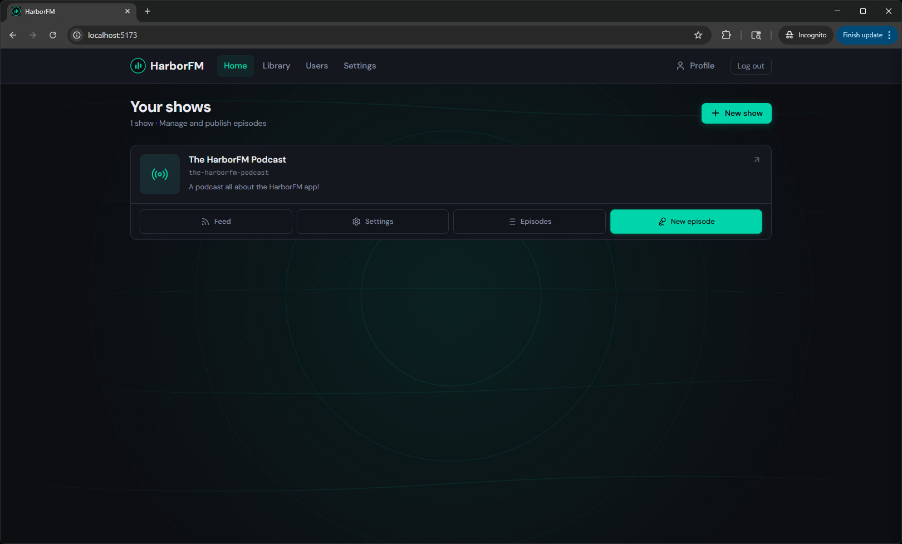

For each show, you can configure the information on the show page.

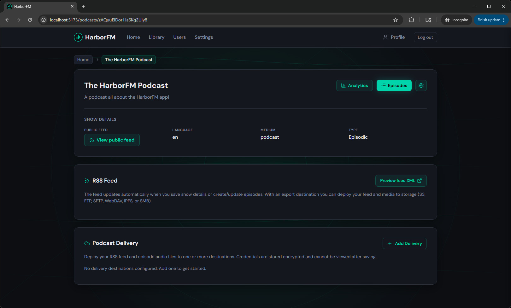

From there you can view and create episodes on the episodes page.

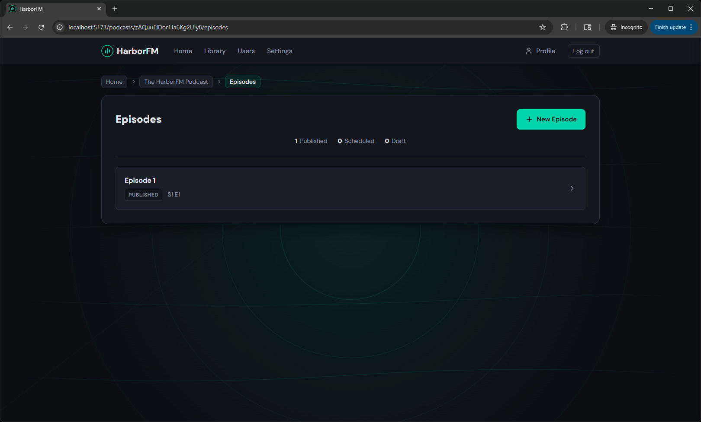

The app provides the ability to 'build' a podcast from a list of audio segments. You can either record a new section or insert audio from an existing audio file you already have.

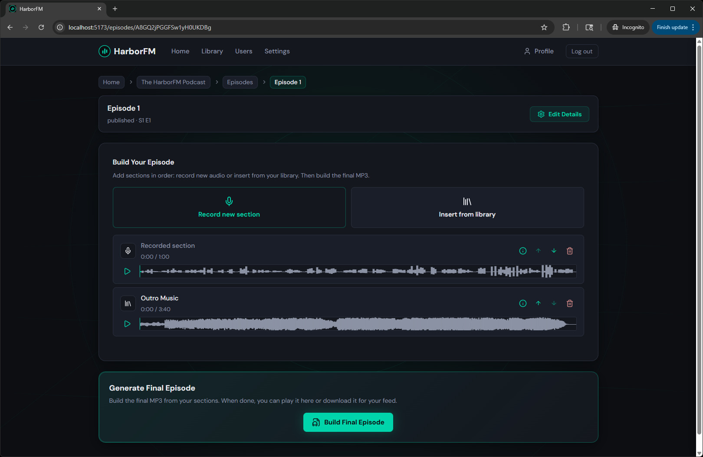

When you go to record a segment, you can click on the record button and just talk away. When done, click stop. You will have the option to listen to it back, try again, or add it to the end of the list.


When inserting from a library, you will see a list of the audio files you've uploaded before. You can upload audio from this screen as well. Just click the clip you want to use.


Once a new segment is added, if you have Whisper enabled, you can generate a transcript and then view it. You can listen back to just that segment of the transcript and even delete that part of the audio if you'd like.


If you have a transcript, you can also prompt an LLM about the segment in order to get tips, feedback, or questions about the segment.


You also have the option to trim the start and end of a segment. You can also remove silence or apply noise suppression to the clip. The remove silence will remove any silence that lasts longer than 1.5 seconds. 


Once you're finished building your episode, at the bottom you can click "Make Final Episode" and this will generate the final audio file. You can customize the settings, such as mono or stereo, on the site settings page. Whenever you change your podcast and are ready for a new version, just click it again. Once you've generated a final episode, an option to download it will appear so you can upload it to other platforms or share it before publishing.

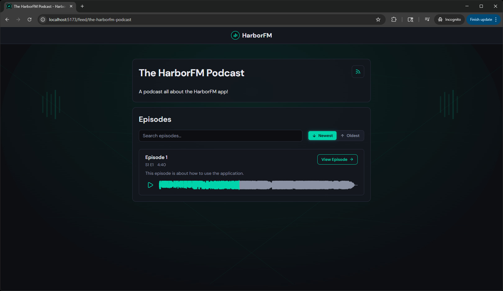

Once you're happy with a change or a new episode, you can configure the podcast to uploaded to a remote server on the podcast show page. You have the ability to deploy to S3, FTP, SFTP, WebDAV, IPFS, and SMB. The configuration is encrypted at rest with the `HARBORFM_SECRETS_KEY` key. If you push your podcast to a remote server, the built in analytics page will not record any information for files or feeds served from those remote servers.

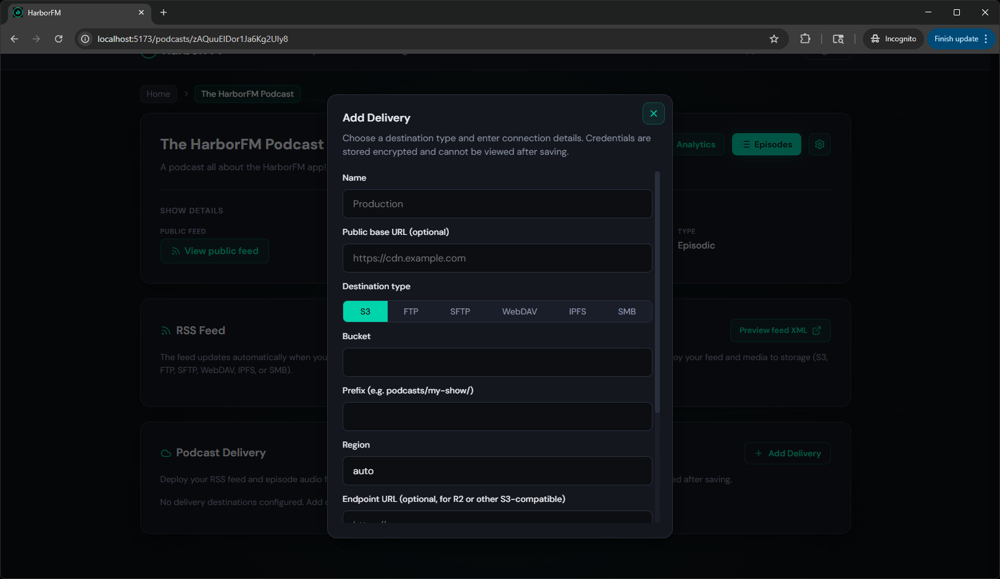

You can view, edit, and delete audio files in your library on the library page.

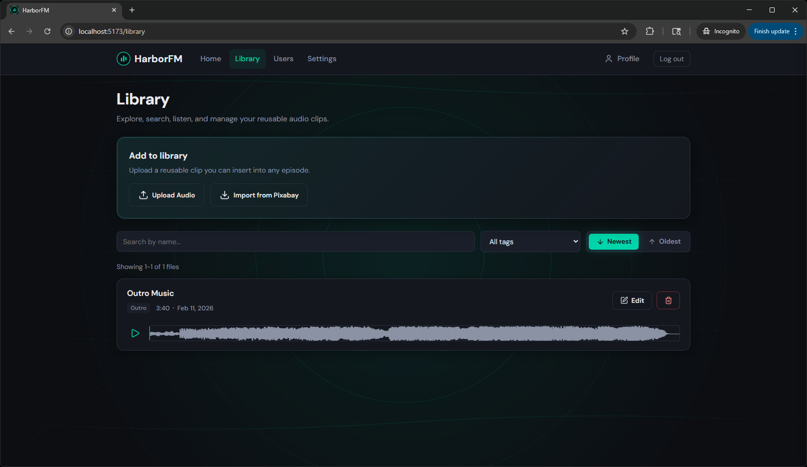

Admins can view a list of users on the users page. You can view the list of podcasts for a user, their library, and edit their information from this page. You can change their password or disable/enable their account. You can also configure a limit for max podcasts, max episodes, and max storage.

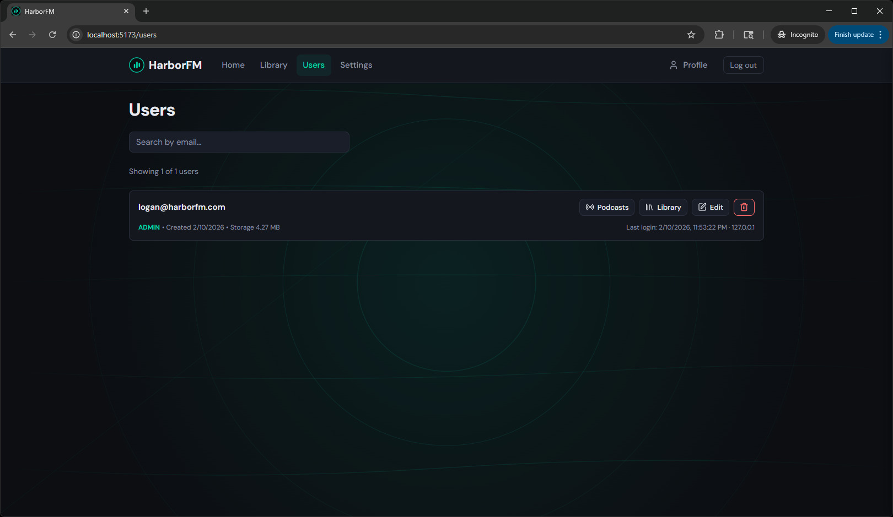

Admins have access to a global settings page where they can manage:

- Account registration (enable/disable)
- Public feeds (enable/disable)
- Welcome banner
- Default limits for new users
- Episode output options
- GeoLite2
- Whisper ASR
- LLMs
- Captcha
- Email

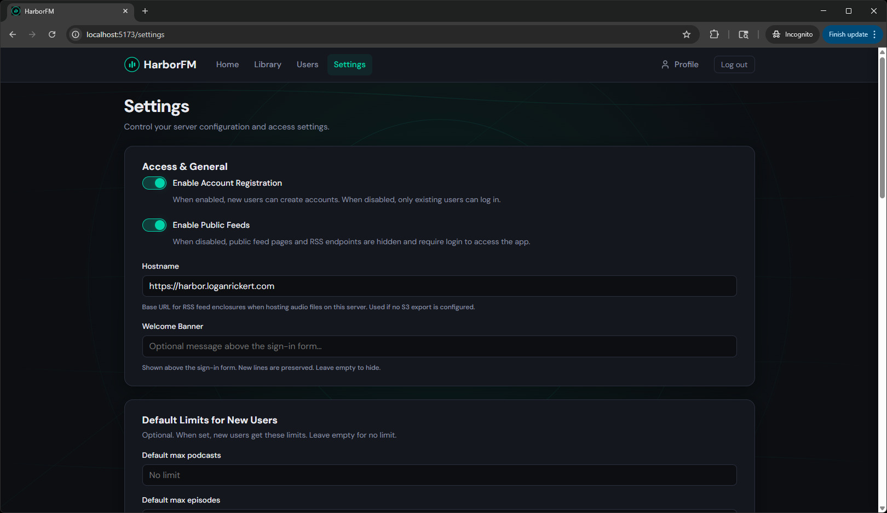

All users can view a profile page where they can see their basic account information. This page also has a list of the user's API keys.

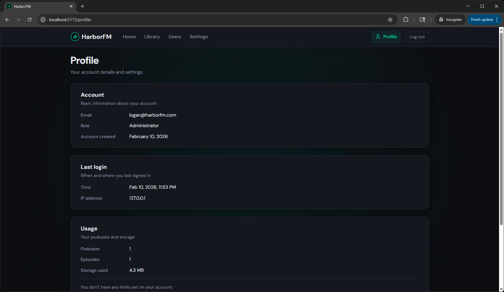

Lastly, there is an analytics page that has the statistics for views/listens that take place within the application on the public feed. The determination if it's a bot or a human may not be very accurate so please take it with a grain of salt. The request vs listens may not be very accurate either. This page is more just to give you a general feel more than an specialized analytics page.

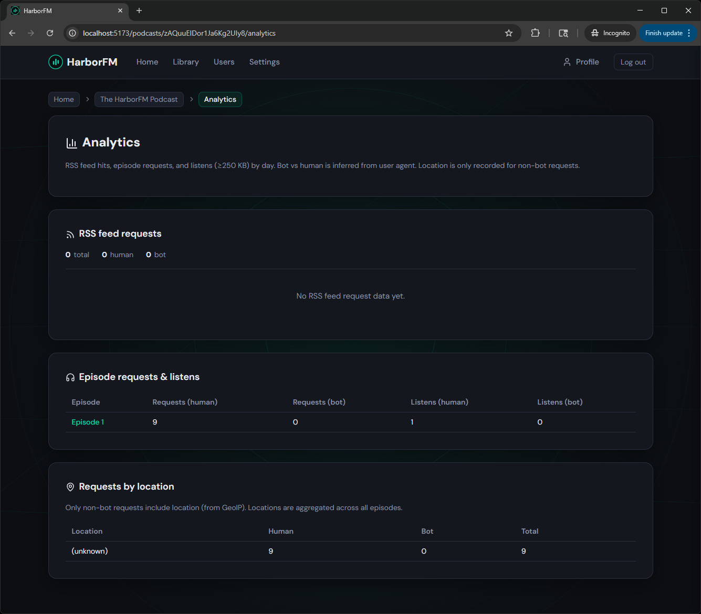

## Requirements

- **Node.js** 22 or newer
- **pnpm** (recommended; the repo uses pnpm workspaces)
- **ffmpeg**
- **audiowaveform** ([bbc/audiowaveform](https://github.com/bbc/audiowaveform)) - e.g. on macOS: `brew install audiowaveform`; on Linux, build from source or use a package if available

## Quick start (local)

1. Clone the repo and install dependencies:

   ```bash
   git clone https://github.com/LoganRickert/harborfm.git
   cd harborfm
   pnpm install
   ```

2. Run migrations:

   ```bash
   pnpm run db:migrate
   ```

3. Start the app:

   ```bash
   pnpm run dev
   ```

   This runs the API and the web dev server. Open the URL shown (e.g. http://localhost:5173). On first run, get the one-time setup URL from the server logs (e.g. `/setup?id=...`), open it in the browser, create the admin account, then sign in.

## Docker

You can build and run HarborFM as a single container. The image includes Node 22, ffmpeg, and the built app; the server serves both the API and the static web app.

### Build

From the repo root:

```bash
docker build -t harborfm .
```

Or use the root script:

```bash
pnpm run docker:build
```

### Run

The app expects two writable directories: `/data` (SQLite DB, uploads, processed audio, RSS, artwork, library) and `/secrets` (JWT and encryption keys). Mount them independently:

```bash
docker run -d \
  --name harborfm \
  -p 3001:3001 \
  -v harborfm-data:/data \
  -v harborfm-secrets:/secrets \
  harborfm
```

Then open http://localhost:3001 (or your host and port). On first run, migrations run automatically. The one-time setup URL is printed in the container logs; open it to create the admin account, then sign in.

### Docker environment variables

All environment variables supported by the server work the same in Docker. Set them with `-e` or an env file. The table below matches `server/src/config.ts`, `server/src/services/paths.ts`, and related server code.

| Variable | Default | Description |
|----------|---------|-------------|
| **Server** | | |
| `PORT` | `3001` | Port the server listens on |
| `HOST` | `0.0.0.0` | Listen host |
| `LOGGER` | (true) | Set to `false` or `0` to disable Fastify logger |
| `TRUST_PROXY` | (true) | Set to `false` or `0` when not behind a reverse proxy |
| `API_PREFIX` | `api` | API path segment; routes live under `/${API_PREFIX}/` |
| `CORS_ORIGIN` | (auto) | `true`/`1` to allow request origin; in production default is false |
| **Paths** | | |
| `DATA_DIR` | `./data` | Directory for DB, uploads, processed audio, RSS, artwork, library (Docker: often `/data`) |
| `SECRETS_DIR` | `./secrets` | Directory for jwt-secret.txt and secrets-key.txt (Docker: often `/secrets`) |
| `PUBLIC_DIR` | `./public` | Directory to serve static web app from |
| `DB_FILENAME` | (from APP_NAME) | SQLite filename under DATA_DIR (e.g. `harborfm.db`) |
| **Secrets & cookies** | | |
| `JWT_SECRET` | (none) | Secret for signing JWTs; required in production (use a long random string) |
| `HARBORFM_SECRETS_KEY` | (none) | Optional key for encrypting export credentials (base64/base64url) |
| `COOKIE_SECURE` | (auto) | Set to `true` when using HTTPS so cookies are Secure; in production default is true if unset |
| `NODE_ENV` | (development) | Set to `production` in Docker; affects CORS and cookie Secure default |
| `CSRF_COOKIE_NAME` | (from APP_NAME) | Name of the CSRF cookie |
| `CSRF_COOKIE_MAX_AGE_SECONDS` | `604800` | CSRF cookie max age (7 days) |
| `JWT_COOKIE_NAME` | (from APP_NAME) | Name of the JWT session cookie |
| `JWT_COOKIE_SIGNED` | (false) | Set to `true` or `1` to sign the JWT cookie (requires @fastify/cookie secret) |
| **Recording & storage** | | |
| `RECORD_MIN_FREE_MB` | `5` | Min free storage (MB) required to record a new section |
| **RSS & sitemap** | | |
| `RSS_CACHE_MAX_AGE_MS` | `3600000` | RSS/sitemap cache max age in ms (1 hour) |
| `RSS_FEED_FILENAME` | `feed.xml` | RSS feed filename |
| `SITEMAP_FILENAME` | `sitemap.xml` | Sitemap filename for per-podcast/static sitemaps |
| `SITEMAP_INDEX_FILENAME` | `index.xml` | Sitemap index filename (root sitemap) |
| **Upload limits (MB)** | | |
| `EPISODE_AUDIO_UPLOAD_MAX_MB` | `500` | Max episode source audio upload size |
| `SEGMENT_UPLOAD_MAX_MB` | `100` | Max recorded segment upload size |
| `LIBRARY_UPLOAD_MAX_MB` | `50` | Max library asset upload size |
| `MULTIPART_MAX_MB` | `500` | Max multipart body size for Fastify |
| `ARTWORK_MAX_MB` | `5` | Max podcast/episode artwork upload size |
| **Binaries** | | |
| `FFMPEG_PATH` | `ffmpeg` | Path to ffmpeg binary |
| `FFPROBE_PATH` | `ffprobe` | Path to ffprobe binary |
| `AUDIOWAVEFORM_PATH` | `audiowaveform` | Path to audiowaveform binary |
| `GEOIPUPDATE_PATH` | `geoipupdate` | Path to geoipupdate binary (MaxMind GeoIP) |
| `SMBCLIENT_PATH` | `smbclient` | Path to smbclient binary (SMB export) |
| **GeoIP** | | |
| `GEOIP_CONF_FILENAME` | `GeoIP.conf` | GeoIP config filename for geoipupdate |
| `GEOIP_EDITION_IDS` | `GeoLite2-Country GeoLite2-City` | GeoIP edition IDs (space-separated) |
| **Audio** | | |
| `WAVEFORM_EXTENSION` | `.waveform.json` | Extension for waveform JSON files |
| **Auth & users** | | |
| `MAX_PLATFORM_INVITES_PER_DAY` | `10` | Max "invite to platform" emails per inviter per 24 hours |
| `API_KEY_PREFIX` | `hfm_` | Prefix for API keys |
| `MAX_API_KEYS_PER_USER` | `5` | Max API keys per user |
| `FORGOT_PASSWORD_RATE_MINUTES` | `5` | Cooldown (minutes) between password-reset requests per email |
| `RESET_TOKEN_EXPIRY_HOURS` | `1` | Password-reset and set-password link validity (hours) |
| **Login protection** | | |
| `LOGIN_FAILURE_THRESHOLD` | `3` | Ban after this many failed login attempts in the window |
| `LOGIN_BAN_MINUTES` | `10` | Login ban duration (minutes) |
| `LOGIN_WINDOW_MINUTES` | `10` | Window (minutes) for counting login failures |
| **Rate limits** | | |
| `RATE_LIMIT_MAX` | `100` | Global rate limit: max requests per time window |
| `RATE_LIMIT_TIME_WINDOW` | `1 minute` | Global rate limit time window |
| **Podcast stats** | | |
| `STATS_FLUSH_INTERVAL_MS` | `60000` | Podcast stats flush interval (ms) |
| `LISTEN_THRESHOLD_BYTES` | `256000` | Min bytes requested in one range to count as a listen (250 KB) |
| **Swagger** | | |
| `SWAGGER_UI_ROUTE_PREFIX` | (from API_PREFIX) | Swagger UI route (e.g. `/api/docs`) |
| `SWAGGER_UI_THEME_CSS_FILENAME` | (from APP_NAME) | Swagger UI theme CSS filename |
| `SWAGGER_ENABLED` | (true outside production) | Set to `true` to serve Swagger UI in production |
| **OpenAI** | | |
| `OPENAI_CHAT_COMPLETIONS_URL` | `https://api.openai.com/v1/chat/completions` | OpenAI chat completions API URL |
| `OPENAI_MODELS_URL` | `https://api.openai.com/v1/models` | OpenAI models API URL (e.g. for testing API key) |
| **SendGrid** | | |
| `SENDGRID_SCOPES_URL` | `https://api.sendgrid.com/v3/scopes` | SendGrid scopes API URL (e.g. for testing API key) |
| `SENDGRID_MAIL_SEND_URL` | `https://api.sendgrid.com/v3/mail/send` | SendGrid mail send API URL |
| **CAPTCHA** | | |
| `RECAPTCHA_VERIFY_URL` | `https://www.google.com/recaptcha/api/siteverify` | reCAPTCHA siteverify API URL |
| `HCAPTCHA_VERIFY_URL` | `https://hcaptcha.com/siteverify` | hCaptcha siteverify API URL |
| **FTP** | | |
| `FTP_CLIENT_TIMEOUT_MS` | `60000` | FTP client timeout (ms) |
| **Import** | | |
| `IMPORT_ALLOW_PRIVATE_URLS` | (false) | Set to `true` or `1` to allow podcast import from private/internal URLs (localhost, 10.x, 192.168.x, etc). Dev/testing only; disables SSRF protection. |
| **Roles** | | |
| `ROLE_MIN_EDIT_SEGMENTS` | `editor` | Minimum share role to edit segments (`view`, `editor`, `manager`, `owner`) |
| `ROLE_MIN_EDIT_METADATA` | `manager` | Minimum share role to edit episode/podcast metadata |
| `ROLE_MIN_MANAGE_COLLABORATORS` | `manager` | Minimum share role to manage collaborators |

## Running without Docker

The server serves both the API and the static web app; no separate web server is required for production.

### Deploy with PM2

From the repo root, run the deploy script. It installs dependencies (`pnpm install --frozen-lockfile`), builds the project, then starts or reloads the app under PM2 using `ecosystem.config.cjs`:

```bash
pnpm run deploy:pm2
```

Requires **pnpm**, **pm2**, and **Node ≥ 22**. Configure the app via `server/.env` (see [Docker environment variables](#docker-environment-variables) for the full list). PM2 5.2+ will load it from the ecosystem config. Logs go to `logs/harborfm-out.log` and `logs/harborfm-err.log`. When self-hosting, API docs (Swagger) are at `https://<your-host>/api/docs`; API keys are in **Profile → API keys**.

### Manual build and run

1. **Build:** From the repo root, run `pnpm run build` (builds shared, server, and web).

2. **Run:** From the repo root, run `node server/dist/app.js`. Set `DATA_DIR`, `SECRETS_DIR`, and `JWT_SECRET` via env or `server/.env`.

3. **Process manager:** Use the included PM2 config (`ecosystem.config.cjs`) or run under systemd/another manager. Example without the deploy script:

```bash
cd /path/to/harborfm
pnpm run build
pm2 start ecosystem.config.cjs --only harborfm
```

## Features

- **Podcasts and episodes.** Create podcasts with metadata (artwork, categories, explicit, etc.). Add episodes with title, description, season/episode numbers, and status (draft, scheduled, published).

- **Segments.** Each episode is a sequence of segments. A segment is either recorded (audio uploaded for that episode) or reusable (from your library). Reorder, trim, split, and remove silence. The app uses ffmpeg to concatenate segments into the final episode audio.

- **Library.** Upload reusable audio (intros, outros, bumpers, ads). Tag them and insert them into any episode as segments.

- **Transcripts.** For recorded segments you can generate transcripts (via a configurable Whisper ASR URL), edit text, and use SRT-style timings. Optional LLM integration (Ollama or OpenAI) lets you ask questions about a segment’s transcript (e.g. summarise or suggest copy).

- **RSS.** Each podcast has an RSS feed. The app can serve it from the same host or you can deploy it elsewhere via S3 export.

- **Export to S3.** Configure an S3-compatible export per podcast (e.g. AWS S3, Cloudflare R2). Deploy feed and episode audio to a bucket; only changed files are uploaded (ETag comparison). Optional public base URL so the feed and enclosures use your CDN URL.

- **Auth and users.** First-user setup, registration, login, password reset. Optional admin role and user management. Public podcast and episode pages for listeners when public feeds are enabled.

## Embed

When public feeds are enabled, you can embed a single episode player on another site using an iframe.

**Embed URLs:**

- **Main host:** `https://your-harborfm.example/embed/{podcast-slug}/{episode-slug}`
- **Custom domain (linking hostname):** If your podcast uses a custom domain (e.g. `podcast.example.com`), use one segment: `https://podcast.example.com/embed/{episode-slug}`

If a user opens the embed URL directly in the browser (not in an iframe), they are redirected to the full episode page.

**Optional: resize iframe to content (e.g. for mobile)**  
The embed page sends its content height to the parent window so you can avoid a fixed iframe height and double scrollbars. Listen for `message` events and set the iframe height:

```javascript
window.addEventListener('message', function (e) {
  if (e.data?.type === 'harborfm-embed-height' && typeof e.data.height === 'number') {
    document.getElementById('your-embed-iframe').style.height = e.data.height + 'px';
  }
});
```

Check `e.origin` against your HarborFM origin in production if you want to restrict which origins can resize the iframe.

## Tech stack

- **Monorepo:** pnpm workspaces with three packages:
  - **shared** – Zod schemas and shared types
  - **server** – Fastify API, SQLite (better-sqlite3), ffmpeg for audio
  - **web** – React, Vite, TanStack Query

- **Server:** Single Node process serves the API and the built web app (static files from `PUBLIC_DIR`). SQLite for persistence; no separate database server.

- **Audio:** ffmpeg and ffprobe for segment processing (trim, concat, silence removal, etc.). The Docker image includes ffmpeg.

## Project structure

```
harborfm/
├── server/           # API and app entry
├── web/              # React frontend
├── shared/           # Shared schemas and types
├── Dockerfile        # Multi-stage build, Node + ffmpeg
├── package.json      # Root scripts and workspace config
└── pnpm-workspace.yaml
```

## Scripts

From the repo root:

| Script | Description |
|--------|-------------|
| `pnpm run dev` | Run API and web dev servers (concurrent) |
| `pnpm run dev:server` | Run only the API (tsx watch) |
| `pnpm run dev:web` | Run only the web dev server (Vite) |
| `pnpm run build` | Build shared, then server, then web |
| `pnpm run db:migrate` | Run database migrations |
| `pnpm run deploy:pm2` | Deploy to PM2 (install, build, start/reload); see [Deploy with PM2](#deploy-with-pm2) |
| `pnpm run reset-password` | Reset the first user’s password (server) |
| `pnpm run db:clear-ip-bans` | Clear the IP ban table (server) |
| `pnpm run lint` | Lint all packages |
| `pnpm run typecheck` | Type-check all packages |
| `pnpm run test` | Run tests in all packages |
| `pnpm run docker:build` | Build the Docker image (`docker build -t harborfm .`) |
| `pnpm run build:docs` | Build the GitHub pages |

## Permissions

Each podcast has an **owner** (the user who created it) and optional **collaborators** with a role. Access is role-based; admins have full access to all podcasts.

| Role | Allowed actions |
|------|------------------|
| **view** | List/read podcast and episodes, stream audio, view analytics. Read-only. |
| **editor** | Everything in view, plus: edit segments, record new sections, render/build the final episode. |
| **manager** | Everything in editor, plus: create/update episodes and episode artwork, edit show details, configure **Podcast Delivery** (exports), manage collaborators (invite, change role, remove). |
| **owner** | Full control. Only the owner can delete the podcast or transfer ownership. |

- **Collaborators** are managed per show in **Settings → Collaborators**. You invite by email and choose a role (view, editor, or manager). If the person isn’t on Harbor yet, the UI can send them an “invite to the platform” email (rate-limited).
- **Storage** for a show (recorded segments, episode source audio) counts against the **podcast owner’s** storage limit, not the collaborator’s. If the owner is at or near their limit, “Record new section” is disabled for everyone on that show.
- **New episode** is only available to **managers** and the **owner**; view and editor roles see it disabled.

## Export

Podcast delivery exports push your RSS feed and episode audio to a destination. Configure one or more exports per show in **Settings → Podcast Delivery**; credentials are stored encrypted. Deploy skips files that are unchanged (using MD5 sidecar files where the service doesn’t provide hashes).

Supported export types and example request bodies (for create/update):

### S3 (AWS)

```json
{
  "mode": "S3",
  "name": "My Podcast on AWS",
  "bucket": "my-podcast-bucket",
  "prefix": "podcast",
  "region": "us-east-1",
  "access_key_id": "AKIA...",
  "secret_access_key": "your-secret-key",
  "public_base_url": "https://my-podcast-bucket.s3.amazonaws.com"
}
```

### R2 (Cloudflare)

```json
{
  "mode": "S3",
  "name": "My Podcast on R2",
  "bucket": "my-podcast",
  "prefix": "",
  "region": "auto",
  "endpoint_url": "https://YOUR_ACCOUNT_ID.r2.cloudflarestorage.com",
  "access_key_id": "your-r2-access-key",
  "secret_access_key": "your-r2-secret-key",
  "public_base_url": "https://pub-xxx.r2.dev"
}
```

### B2 (Backblaze)

```json
{
  "mode": "S3",
  "name": "My Podcast on B2",
  "bucket": "my-podcast-bucket",
  "prefix": "podcast",
  "region": "us-west-002",
  "endpoint_url": "https://s3.us-west-002.backblazeb2.com",
  "access_key_id": "your-key-id",
  "secret_access_key": "your-application-key",
  "public_base_url": "https://f003.backblazeb2.com/file/my-podcast-bucket"
}
```

### FTP

```json
{
  "mode": "FTP",
  "name": "My FTP Server",
  "host": "ftp.example.com",
  "port": 21,
  "username": "ftpuser",
  "password": "secret",
  "path": "/public/podcast",
  "secure": false,
  "public_base_url": "https://cdn.example.com/podcast"
}
```

### SFTP

```json
{
  "mode": "SFTP",
  "name": "My SFTP Server",
  "host": "sftp.example.com",
  "port": 22,
  "username": "deploy",
  "password": "secret",
  "path": "/var/www/podcast/",
  "public_base_url": "https://cdn.example.com/podcast"
}
```

Use `private_key` instead of `password` for key-based auth (PEM string).

### WebDAV

```json
{
  "mode": "WebDAV",
  "name": "My WebDAV",
  "url": "https://webdav.example.com/remote.php/dav/files/user/",
  "username": "user",
  "password": "secret",
  "path": "podcast/",
  "public_base_url": "https://cdn.example.com/podcast"
}
```

### IPFS

```json
{
  "mode": "IPFS",
  "name": "My IPFS Node",
  "api_url": "http://127.0.0.1:5001",
  "path": "podcast/",
  "gateway_url": "https://ipfs.io",
  "public_base_url": "https://my-gateway.example.com/ipfs"
}
```

Optional: `api_key`, `username`, and `password` for authenticated nodes (e.g. behind Caddy with API key or Basic auth).

### SMB

```json
{
  "mode": "SMB",
  "name": "My SMB Share",
  "host": "nas.example.com",
  "port": 445,
  "share": "podcast",
  "username": "deploy",
  "password": "secret",
  "domain": "",
  "path": "feed/",
  "public_base_url": "https://cdn.example.com/podcast"
}
```

`port` is optional (defaults to 445 when omitted). Set `domain` for Windows domain auth if needed.

## Local Testing

Use the setup below to try HarborFM’s email and deployment features locally without real servers.

### SMTP (email)

Run a local SMTP server and web UI with [smtp4dev](https://github.com/rnwood/smtp4dev):

```bash
docker run --rm -it -p 5000:80 -p 2525:25 -p 110:110 rnwood/smtp4dev
```

- **Web UI:** http://localhost:5000  
- **SMTP:** `localhost:2525` (no TLS)  
- **POP3:** `localhost:110`  

Configure HarborFM Settings → Email with host `localhost`, port `2525`, and any from address. Accepts any username/password.

### Deployment targets (FTP, SFTP, WebDAV, IPFS, SMB)

Save the **docker-compose.yml** block below in a directory (e.g. a test folder), create the data directories, then start the stack:

```bash
mkdir -p ftp ipfs sftp sftp-keys smb webdav
docker compose up -d
```

| Service | Host port(s) | Credentials | Data dir |
|--------|---------------|-------------|----------|
| **FTP** (vsftpd) | 9400 (control), 9401–9410 (passive) | `ftpuser` / `ftppass` | `./ftp` |
| **SFTP** (OpenSSH) | 9411 | `sftpuser` / `sftppass` | `./sftp` |
| **WebDAV** | 9412 | `davuser` / `davpass` | `./webdav` |
| **IPFS** (via Caddy proxy) | 9413 (API), 9414 (Gateway), 9415 (Swarm) | `ipfsuser` / `ipfspass` | `./ipfs` |
| **SMB** (Samba) | 9416 | `smbuser` / `smbpass`, share `share` | `./smb` |

**docker-compose.yml:**

```yaml
services:
  # FTP (vsftpd)
  ftp:
    image: fauria/vsftpd
    container_name: test-ftp
    restart: unless-stopped
    environment:
      FTP_USER: ftpuser
      FTP_PASS: ftppass
      PASV_ADDRESS: host.docker.internal
      PASV_MIN_PORT: 9401
      PASV_MAX_PORT: 9410
      FILE_OPEN_MODE: "0666"
      LOCAL_UMASK: "022"
    volumes:
      - ./ftp:/home/vsftpd
    ports:
      - "9400:21"
      - "9401-9410:9401-9410"

  # SFTP (OpenSSH)
  sftp:
    image: atmoz/sftp
    container_name: test-sftp
    restart: unless-stopped
    command: "sftpuser::1001:1001:upload"
    volumes:
      - ./sftp:/home/sftpuser/upload
      - ./sftp-keys:/home/sftpuser/.ssh/keys
    ports:
      - "9411:22"

  # WebDAV
  webdav:
    image: bytemark/webdav
    container_name: test-webdav
    restart: unless-stopped
    environment:
      AUTH_TYPE: Basic
      USERNAME: davuser
      PASSWORD: davpass
      LOCATION: /webdav
    volumes:
      - ./webdav:/var/lib/dav
    ports:
      - "9412:80"

  # IPFS (Kubo) - internal only; use ipfs-proxy for auth
  ipfs:
    image: ipfs/kubo:latest
    environment:
      IPFS_TELEMETRY: false
    container_name: test-ipfs
    restart: unless-stopped
    volumes:
      - ./ipfs:/data/ipfs
    expose:
      - "5001"
      - "8080"
      - "4001"
    networks:
      - ipfsnet

  # IPFS auth proxy (Caddy Basic Auth)
  ipfs-proxy:
    image: caddy:2
    container_name: test-ipfs-proxy
    restart: unless-stopped
    depends_on:
      - ipfs
    networks:
      - ipfsnet
    ports:
      - "9413:9413"
      - "9414:9414"
      - "9415:4001"
    volumes:
      - ./ipfs/Caddyfile:/etc/caddy/Caddyfile:ro

  # SMB (Samba) - share name: share. Some clients expect port 445; use host 445 or test from another container.
  smb:
    image: dperson/samba
    container_name: test-smb
    restart: unless-stopped
    command: >
      -p
      -u "smbuser;smbpass"
      -s "share;/share;yes;no;no;smbuser"
    volumes:
      - ./smb:/share
    ports:
      - "9416:445"

networks:
  ipfsnet:
    driver: bridge
```

**IPFS Caddyfile** - save as `ipfs/Caddyfile`. The hash below is bcrypt for `ipfspass`; replace with your own via `caddy hash-password` if needed.

```
:9413 {
  basicauth {
    ipfsuser $2a$14$P0O6.FVoZP3wJtO/MDDI3OEoiep8iTyrjyEF/vkmNCmGtOHFPVVGW
  }
  reverse_proxy ipfs:5001
}

:9414 {
  basicauth {
    ipfsuser $2a$14$P0O6.FVoZP3wJtO/MDDI3OEoiep8iTyrjyEF/vkmNCmGtOHFPVVGW
  }
  reverse_proxy ipfs:8080
}
```

## Troubleshooting

- **Setup URL / "Server not set up yet"** - On first run, the one-time setup URL is printed in the server (or container) logs. Open that URL in your browser (e.g. `https://your-host/setup?id=...`) to create the admin account. If you lost the URL, restart the server to see it again (the token is regenerated only if the secrets file is missing).
- **ffmpeg or audiowaveform not found** - Ensure they are installed and on your `PATH`. The Docker image includes ffmpeg; for local dev, install via your package manager or [audiowaveform](https://github.com/bbc/audiowaveform) from source.

## Backup and upgrading

Before upgrading, back up **DATA_DIR** (SQLite database, uploads, processed audio, RSS files, artwork, library). Optionally back up **SECRETS_DIR** if you rely on the persisted JWT or secrets key files. Migrations run automatically on server start; no separate migration step is required for upgrades.

## License

MIT. See [LICENSE](LICENSE).
