# HarborFM

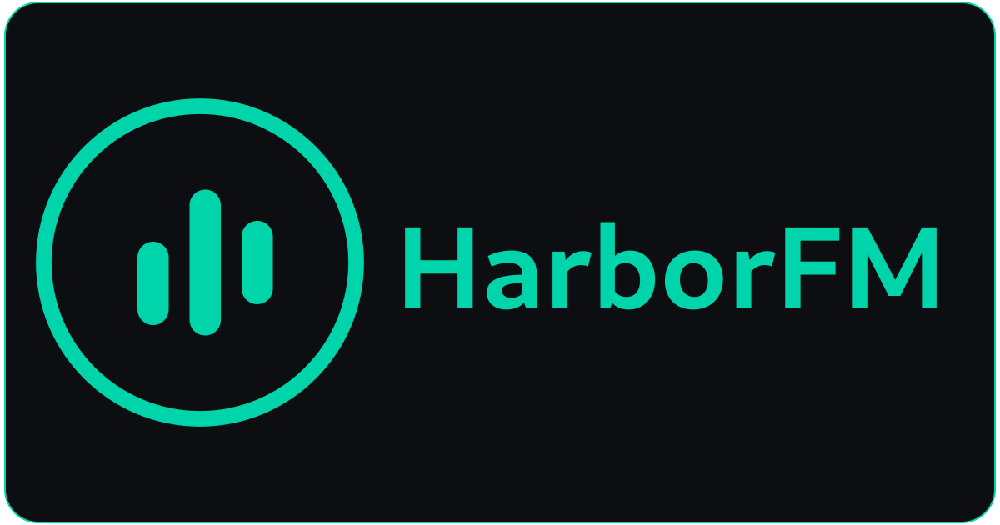

Open source podcast creator. Build episodes from segments: record or upload clips, pull in intros and bumpers from a library, trim and reorder, then export a single audio file and RSS feed.

The app also has PWA so you can add your server to your home screen.

**License:** MIT

**Source:** [https://github.com/LoganRickert/harborfm](https://github.com/LoganRickert/harborfm)

---

## Table of contents

- [Overview](#overview)
- [Requirements](#requirements)
- [Quick start (local)](#quick-start-local)
- [Docker](#docker)
- [Environment variables](#environment-variables)
- [Running without Docker](#running-without-docker)
- [Features](#features)
- [Tech stack](#tech-stack)
- [Project structure](#project-structure)
- [Scripts](#scripts)

---

## Overview

HarborFM lets you assemble podcast episodes from building blocks. Create a show, add episodes, and for each episode add segments: recorded clips (uploaded per episode) or reusable assets from your library (intros, outros, bumpers). Trim, split, remove silence, and reorder. The app concatenates segments with ffmpeg and produces the final episode audio. Generate RSS feeds and deploy to S3-compatible storage (e.g. Cloudflare R2) so listeners can subscribe. Optional: transcripts via Whisper ASR, LLM helpers (Ollama or OpenAI) for copy suggestions, and public feed pages for discovery.

### Quick Start

The app expects a writable directory for data (SQLite DB, uploads, processed audio, RSS files, artwork, library). Bind a volume to `/data`:

```bash
docker run -d \
  --name harborfm \
  -p 3001:3001 \
  -v harborfm-data:/data \
  -e HARBORFM_SECRETS_KEY="your-secure-secret-at-least-32-characters" \
  -e JWT_SECRET="your-secure-secret-at-least-32-characters" \
  harborfm
```

Use nginx+letsencrypt to provide a secure connection.

### Guide and Screenshots 

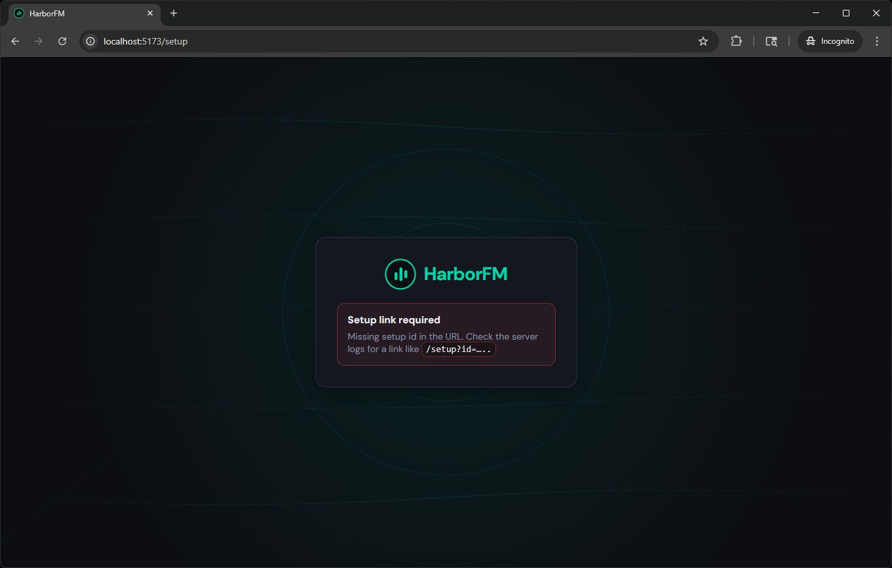

When creating a new instance, you will need to navigate to the correct setup link. The link will be written to the console and is unique to every instance.

For example,

```
Open this URL to initialize the server (runs once):

  /setup?id=oFwK--nBt8YloIVABKA4nOmYy_Kbx7PS
```

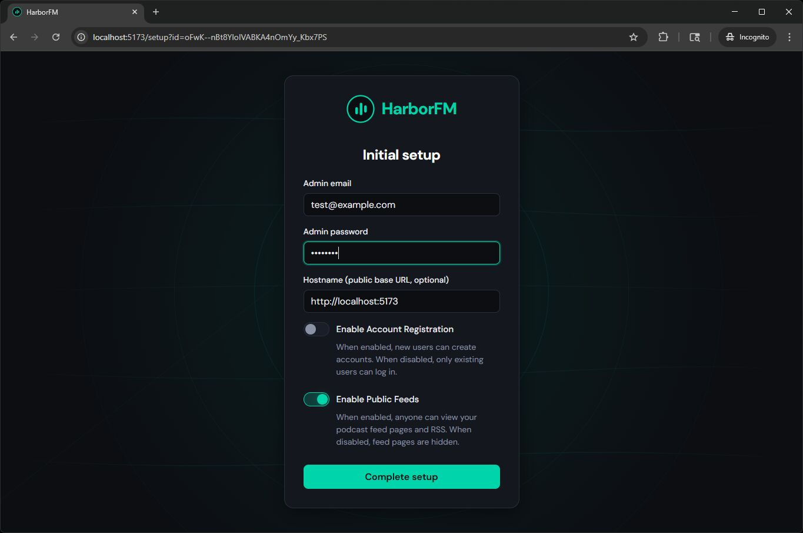

The initial setup will create an admin account. You will need to provide the admin email, a password, and you can enable or disable account registration and public feeds from here.

After you've finished the setup, you can sign into your new account.

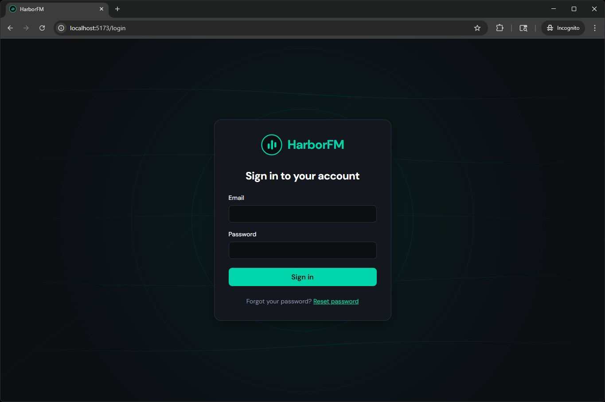

Once signed in, you will see the dashboard which has a list of podcast shows.

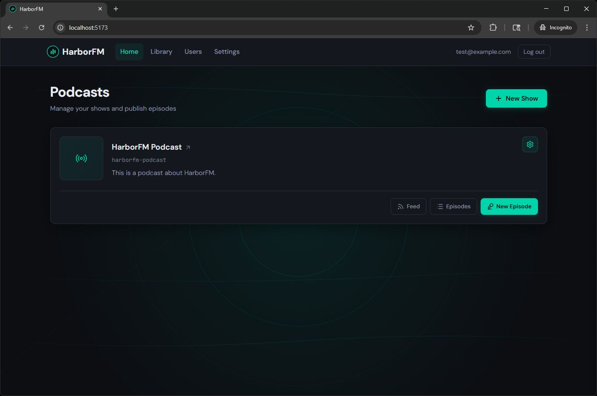

For each show, you can configure the information on the show page.

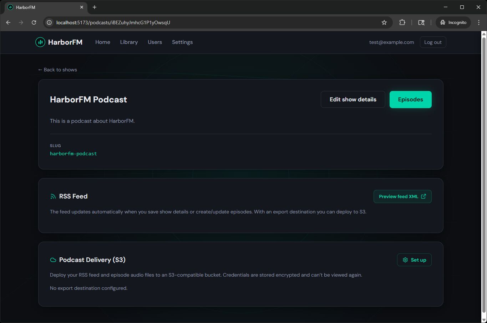

From there you can view and create episodes on the episodes page.

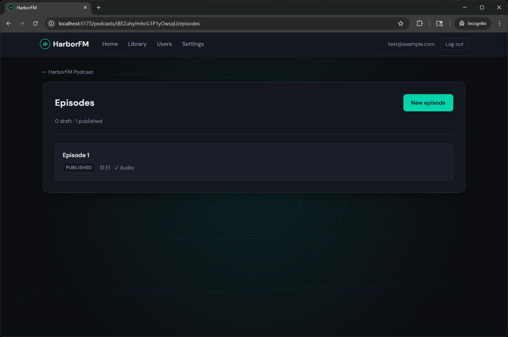

The app provides the ability to 'build' a podcast from a list of audio segments. You can either record a new section or insert audio from an existing audio file you already have.

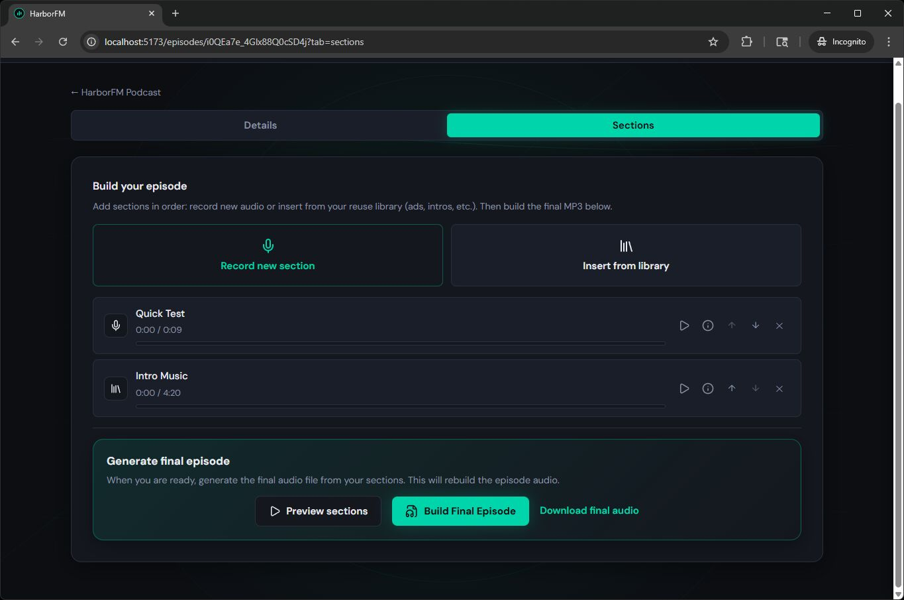

When you go to record a segment, you can click on the record button and just talk away. When done, click stop. You will have the option to listen to it back, try again, or add it to the end of the list.

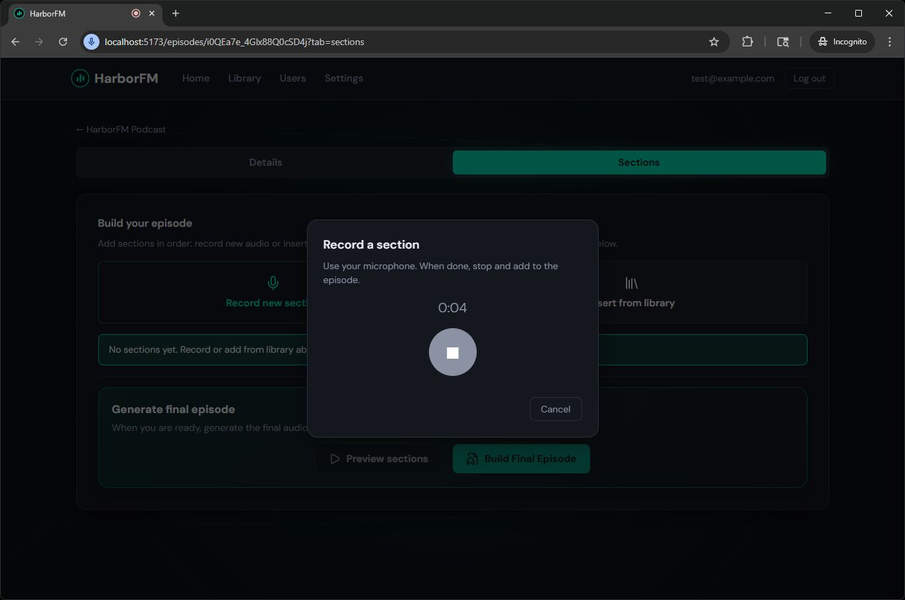

When inserting from a library, you will see a list of the audio files you've uploaded before. You can upload audio from this screen as well. Just click the clip you want to use.

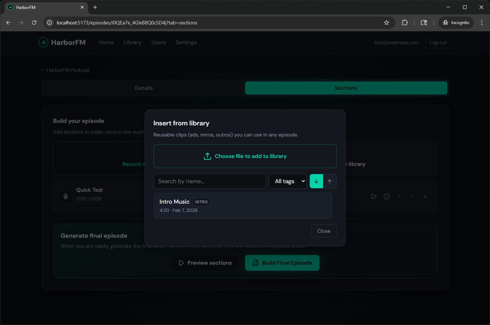

Once a new segment is added, if you have Whisper enabled, you can generate a transcript and then view it. You can listen back to just that segment of the transcript and even delete that part of the audio if you'd like.

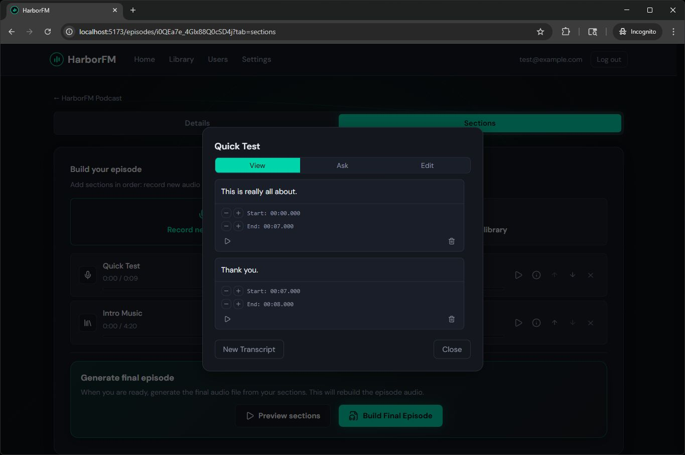

If you have a transcript, you can also prompt an LLM about the segment in order to get tips, feedback, or questions about the segment.

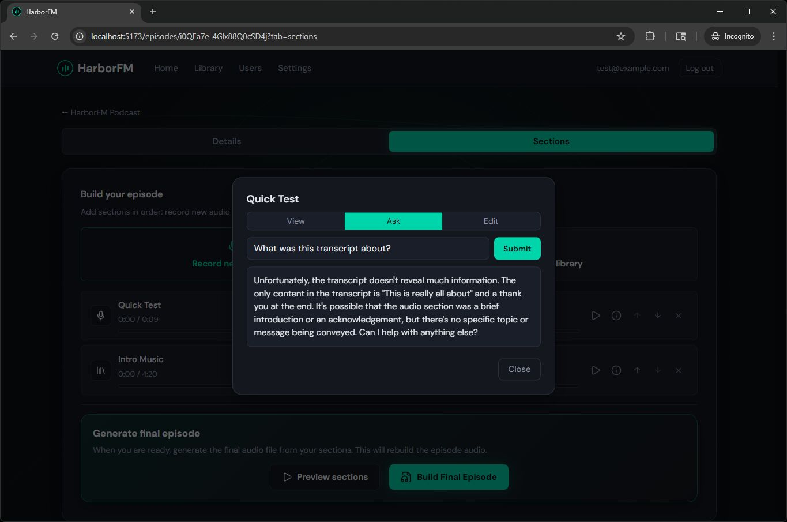

You also have the option to trim the start and end of a segment. You can also remove silence or apply noise suppression to the clip. The remove silence will remove any silence that lasts longer than 1.5 seconds. 

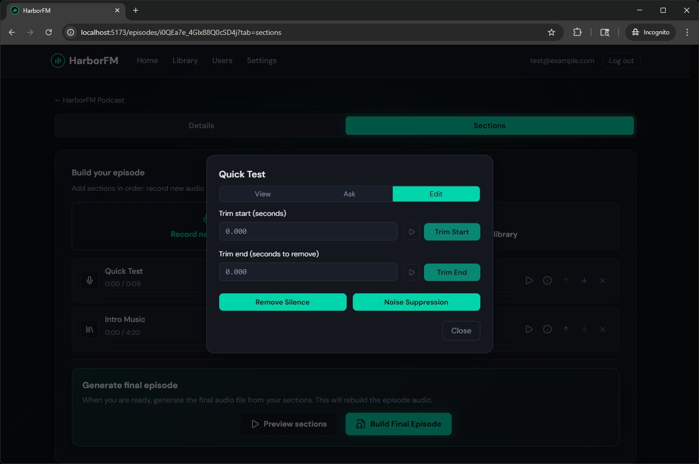

Once you're finished building your episode, at the bottom you can click "Build Final Episode" and this will generate the final audio file. You can customize the settings, such as mono or stereo, on the site settings page. Whenever you change your podcast and are ready for a new version, just click it again. Once you've generated a final episode, an option to download it will appear so you can upload it to other platforms or share it before publishing.

The objective of this application is not to be a podcast hosting platform, but there is the ability to view a public feed of the podcasts if the option is enabled.

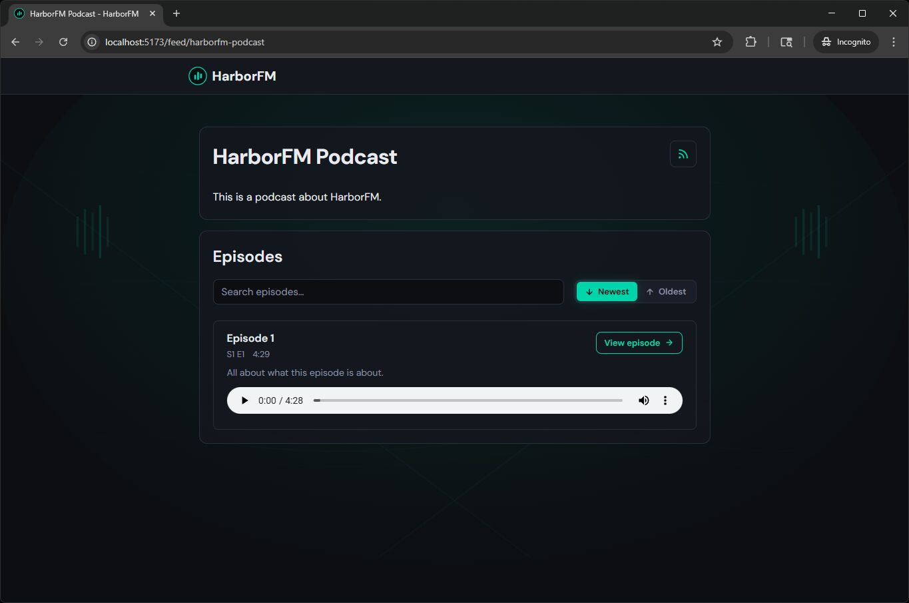

Once you're happy with a change or a new episode, you can configure S3 on the podcast show page. You can configure an API endpoint if you're using something like R2, a CDN url, and more. The key and token are encrypted at rest with the `HARBORFM_SECRETS_KEY` key.

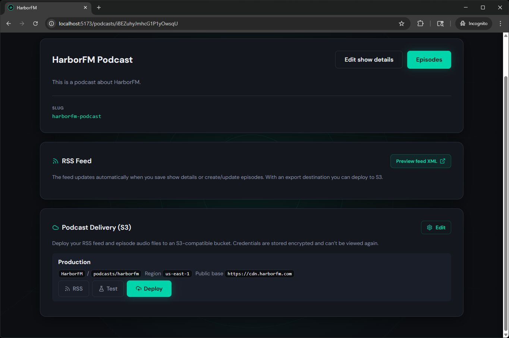

You can view, edit, and delete audio files in your library on the library page.

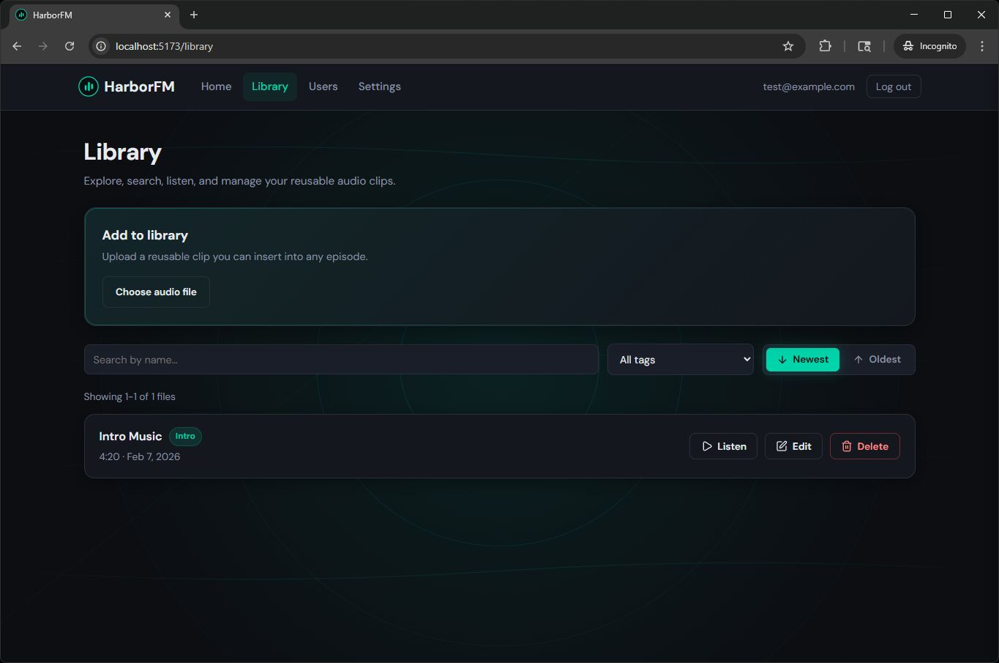

You can view a list of users on the users page. You can view the list of podcasts for a user, their library, and edit their information from this page. You can change their password or disable/enable their account.

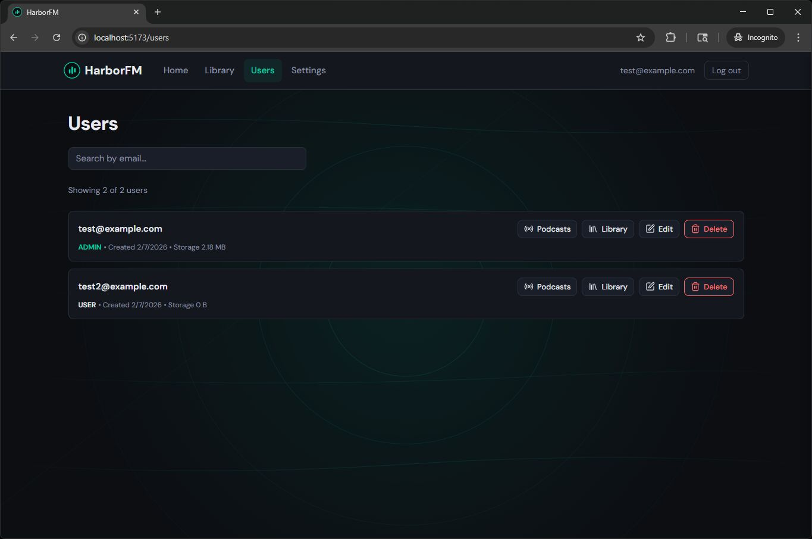

---

## Requirements

- **Node.js** 20 or newer
- **pnpm** (recommended; the repo uses pnpm workspaces)
- **ffmpeg** (for local dev; the Docker image includes it)

---

## Quick start (local)

1. Clone the repo and install dependencies:

   ```bash
   git clone https://github.com/LoganRickert/harborfm.git
   cd harborfm
   pnpm install
   ```

2. Run migrations:

   ```bash
   pnpm run dev:migrate
   ```

3. Start the app:

   ```bash
   pnpm run dev
   ```

   This runs the API and the web dev server. Open the URL shown (e.g. http://localhost:5173). The first user to register becomes the setup user; complete setup then log in.

---

## Docker

You can build and run HarborFM as a single container. The image includes Node 20, ffmpeg, and the built app; the server serves both the API and the static web app.

### Build

From the repo root:

```bash
docker build -t harborfm .
```

Or use the root script:

```bash
pnpm run docker:build
```

### Run

The app expects a writable directory for data (SQLite DB, uploads, processed audio, RSS files, artwork, library). Bind a volume to `/data`:

```bash
docker run -d \
  --name harborfm \
  -p 3001:3001 \
  -v harborfm-data:/data \
  -e HARBORFM_SECRETS_KEY="your-secure-secret-at-least-32-characters" \
  -e JWT_SECRET="your-secure-secret-at-least-32-characters" \
  harborfm
```

Then open http://localhost:3001 (or your host and port). On first run, migrations run automatically.

### Docker environment variables

All [environment variables](#environment-variables) supported by the server work the same in Docker. Set them with `-e` or an env file.

| Variable | Default in image | Description |
|----------|------------------|-------------|
| `PORT` | `3001` | Port the server listens on |
| `JWT_SECRET` | (none) | **Required.** Secret for signing JWTs (use a long random string) |
| `HARBORFM_SECRETS_KEY` | (none) | Optional 32-byte hex key for encrypting export credentials |
| `COOKIE_SECURE` | (auto) | Set to `true` when using HTTPS so cookies are Secure |

---

## Running without Docker

1. **Build:** From the repo root, run `pnpm run build`. This builds the shared package, server, and web app.

2. **Run the server:** From the repo root, run `node server/dist/app.js`. Ensure `DATA_DIR` and `JWT_SECRET` are set (env or `server/.env`).

3. **Process manager:** Run the server under pm2, systemd, or another process manager. The repo does not include a pm2 config; add one if you want. Example with pm2:

   ```bash
   cd /path/to/harborfm
   PORT=3001 DATA_DIR=/var/lib/harborfm JWT_SECRET="..." pm2 start server/dist/app.js --name harborfm
   ```

The server serves both the API and the static web app; no separate web server is required for production.

---

## Features

- **Podcasts and episodes.** Create podcasts with metadata (artwork, categories, explicit, etc.). Add episodes with title, description, season/episode numbers, and status (draft, scheduled, published).

- **Segments.** Each episode is a sequence of segments. A segment is either recorded (audio uploaded for that episode) or reusable (from your library). Reorder, trim, split, and remove silence. The app uses ffmpeg to concatenate segments into the final episode audio.

- **Library.** Upload reusable audio (intros, outros, bumpers, ads). Tag them and insert them into any episode as segments.

- **Transcripts.** For recorded segments you can generate transcripts (via a configurable Whisper ASR URL), edit text, and use SRT-style timings. Optional LLM integration (Ollama or OpenAI) lets you ask questions about a segment’s transcript (e.g. summarise or suggest copy).

- **RSS.** Each podcast has an RSS feed. The app can serve it from the same host or you can deploy it elsewhere via S3 export.

- **Export to S3.** Configure an S3-compatible export per podcast (e.g. AWS S3, Cloudflare R2). Deploy feed and episode audio to a bucket; only changed files are uploaded (ETag comparison). Optional public base URL so the feed and enclosures use your CDN URL.

- **Auth and users.** First-user setup, registration, login, password reset. Optional admin role and user management. Public podcast and episode pages for listeners when public feeds are enabled.

---

## Tech stack

- **Monorepo:** pnpm workspaces with three packages:
  - **shared** – Zod schemas and shared types
  - **server** – Fastify API, SQLite (better-sqlite3), ffmpeg for audio
  - **web** – React, Vite, TanStack Query

- **Server:** Single Node process serves the API and the built web app (static files from `PUBLIC_DIR`). SQLite for persistence; no separate database server.

- **Audio:** ffmpeg and ffprobe for segment processing (trim, concat, silence removal, etc.). The Docker image includes ffmpeg.

---

## Project structure

```
harborfm/
├── server/           # API and app entry
├── web/              # React frontend
├── shared/           # Shared schemas and types
├── Dockerfile        # Multi-stage build, Node + ffmpeg
├── package.json      # Root scripts and workspace config
└── pnpm-workspace.yaml
```

---

## Scripts

From the repo root:

| Script | Description |
|--------|-------------|
| `pnpm run dev` | Run API and web dev servers (concurrent) |
| `pnpm run dev:server` | Run only the API (tsx watch) |
| `pnpm run dev:web` | Run only the web dev server (Vite) |
| `pnpm run build` | Build shared, then server, then web |
| `pnpm run dev:migrate` | Run database migrations (dev) |
| `pnpm run reset-password` | Reset the first user’s password (server) |
| `pnpm run db:clear-ip-bans` | Clear the IP ban table (server) |
| `pnpm run lint` | Lint all packages |
| `pnpm run typecheck` | Type-check all packages |
| `pnpm run test` | Run tests in all packages |
| `pnpm run docker:build` | Build the Docker image (`docker build -t harborfm .`) |

---

## License

MIT. See [LICENSE](LICENSE).
